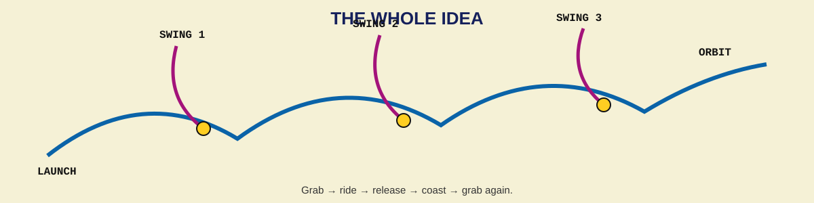

  

  <b>DONKEY KONG TO SPACE</b> 
  A very serious investigation of a very silly geometry.

---

## 🚀 The idea

Space is not mainly **up**.

Orbit is mostly **sideways, very fast**.

Rockets solve that by carrying an enormous amount of fuel and doing nearly all the work in one ride.

A space elevator tries to solve it with one enormous cable.

**SpaceDonkey asks: what if we use lots of swings instead?**

  

Grab one. Ride it for a while. Let go. Glide, coast, or even dive. Grab the next one.

Each swing only needs to move you into a state the **next** swing can reach.

Eventually you let go fast enough that you keep missing Earth.

**That's orbit.**

---

## 🕹️ Donkey Kong already knows the algorithm

That is basically the whole front-page explanation.

The weird part is that the payload does **not** have to keep going upward.

Down is allowed.

A release can lead to a glide, coast, or dive if that gives the next swing a better chance to catch you.

> **The goal is not to keep climbing. The goal is to keep reaching the next legal move.**

---

## 🌎 Turn the space elevator upside down

A normal space elevator hangs one gigantic cable **up from Earth**.

SpaceDonkey imagines persistent infrastructure **above Earth**, with many smaller working tethers hanging inward.

Think less:

**one impossible ladder**

and more:

**a whole planet wearing monkey bars.**

The equator is especially interesting because Earth is already rotating eastward fastest there, and a circum-Earth backbone gives us room for lots of separate Donkeys.

The backbone itself is an open question. Existing orbital-ring ideas are obvious prior art, but SpaceDonkey does **not** assume we have already solved the global structure.

---

## 🪢 Why swings?

Because a swing can buy **time**.

A violent one-shot hook says:

> Be at exactly the right place, at exactly the right speed, at exactly the right instant.

A long swing might instead say:

> Get close enough. Match me gently. Grab on. I will carry you while I add momentum.

Longer swings can reduce acceleration for the same tip speed:

\[
a = \frac{v^2}{r}
\]

So the lower Donkeys may want to be **long, slow, and forgiving**.

We call that **grace**.

Later Donkeys can be faster after the payload is already much more controlled.

---

## ⚡ Where does the energy come from?

Not nowhere.

SpaceDonkey is **not** a perpetual-motion machine.

Every swing that gives the payload momentum must get that momentum from somewhere, and the system has to put it back later.

The attraction is architectural:

- the heavy machinery can stay outside the payload,
- the same machinery can be reused,
- energy can be supplied electrically over time,
- the payload does not need to carry all of its propulsion hardware and reaction mass,
- inbound traffic might someday return some energy and momentum to the system.

Think **railroad to orbital velocity**, not free energy.

---

## 🤔 Has anybody thought of this before?

**A lot of the pieces, yes.** Good. We want to steal the good parts.

Serious prior work includes:

- **Paul Birch's orbital rings** — circum-Earth structures and hanging skyhooks.
- **HASTOL** — a suborbital vehicle meets a rotating tether and gets carried to a higher-energy trajectory.
- **NASA MXER** — momentum-exchange tethers that throw payloads and slowly recharge afterward.
- **Sling-on-a-Ring** — remarkably close visually: rotating slings attached to an equatorial ring.
- **Multi-stage tether systems** — sequential tether handoffs connected by free-flight trajectories.

SpaceDonkey is **not** claiming to invent space tethers.

The specific question here is:

> **What happens if we use enough small stages that no individual Donkey needs to be heroic?**

Can multiplicity buy softer capture, smaller momentum jumps, more recovery options, and enough **grace** to make the whole route compose?

[**→ Read the technical research ledger**](RESEARCH.md)

---

## 🔬 What do we actually test first?

Not a 40,000 km ring.

**One Donkey.**

Can one reusable tether:

1. meet a ballistic payload with low relative velocity,
2. capture it without a huge shock,
3. accelerate it over a useful arc,
4. release it into a recoverable free-flight path,
5. and restore its own lost momentum efficiently?

If no: excellent. We killed the idea cheaply.

If yes: add **Donkey #2**.

Then ask whether the first release naturally falls inside the second Donkey's capture region.

Then keep going until either physics says **no** or Donkey Kong reaches orbit.

---

  

  <b>SPACE DONKEY RESEARCH PORTAL</b> 
  <a href="RESEARCH.md">Research ledger</a> •
  <a href="https://nss.org/wp-content/uploads/Orbital-Rings.pdf">Orbital rings</a> •
  <a href="https://www.niac.usra.edu/files/studies/final_report/391Grant.pdf">HASTOL</a> •
  <a href="https://ntrs.nasa.gov/citations/20060005548">MXER</a> •
  <a href="https://doi.org/10.1016/j.phpro.2011.08.021">Sling-on-a-Ring</a>

---

  <b>THE ENTIRE PITCH:</b>  
  Do not build one impossible road to orbit. 
  <b>Build enough moving handles that you can always reach the next one.</b>

