# SpaceDonkey

## Donkey Kong to space

**A wicked geometry of reusable momentum handoffs.**

Space is not mainly *up*.

Orbit is mostly **sideways, very fast**.

A rocket solves that problem by carrying engines and propellant and doing almost all of the work in one continuous ride. A space elevator tries to replace the rocket with one enormous cable.

SpaceDonkey asks a dumber question:

> **What if you just Donkey Kong your way to orbit?**

Grab a swing. Ride it. Let go. Fly for a while. Grab the next swing. Repeat until the last release is fast enough that you keep missing Earth.

That sounds ridiculous.

The pieces are not.

Rotating space tethers, skyhooks, orbital rings, momentum-exchange tethers, staged tether systems, and even a **“Sling-on-a-Ring”** have all been seriously studied. SpaceDonkey is not a claim that nobody thought of space swings before.

The question here is narrower and weirder:

> **Can lots of individually modest, forgiving momentum exchanges compose into a practical path from ordinary flight to orbit?**

---

# Part I — The picture

## 1. Donkey Kong already knows the algorithm

In the game, Donkey Kong does not need one arm long enough to reach the top of the level.

He only needs to reach **the next thing he can grab**.

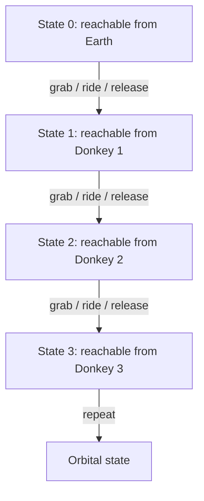

The payload does **not** have to climb monotonically.

It can rise, fall, glide, dive, and rise again. What matters is not that every move goes upward. What matters is that every move leaves the payload in a state the next machine can reach.

**Down is allowed.**

A dive can trade altitude back into speed. A free-flight leg can move the payload toward the next useful rendezvous. The path is through **position and velocity together**, not through altitude alone.

---

## 2. Why a swing?

A swing buys something a one-shot catapult does not:

**time.**

The useful event is not:

> hit a hook at enormous relative speed and survive.

It is:

> meet a moving capture element at low relative speed, attach, spend time accelerating while mechanically supported, then release.

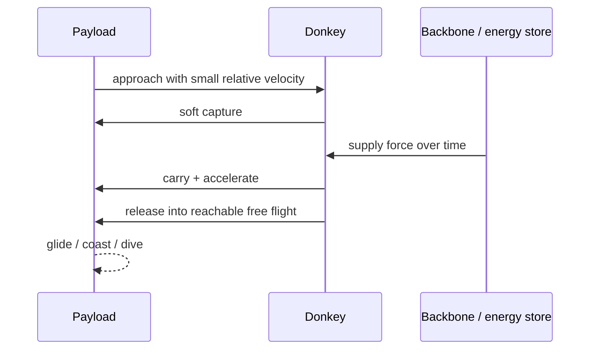

A long swing can be especially interesting near the bottom of the system.

For the same tip speed, a longer radius means a lower angular rate. It also lowers the centripetal acceleration required for a given speed:

\[
a = \frac{v^2}{r}.
\]

So longer early Donkeys may buy **grace**:

- gentler acceleration,
- slower geometric evolution,
- a larger region in which capture can be attempted,
- more time to correct small timing or position errors.

The lower Donkeys do not need to be impressive. They need to be **forgiving**.

Later Donkeys can become faster and more specialized after the payload state is already tightly controlled.

---

## 3. Grace, not heroics

Classic tether concepts often inherit a brutal rendezvous problem: a payload and a tether tip must meet at almost exactly the right place, velocity, and time.

SpaceDonkey asks whether **multiplicity can buy tolerance**.

Instead of one heroic transfer of several kilometres per second, use many smaller transfers.

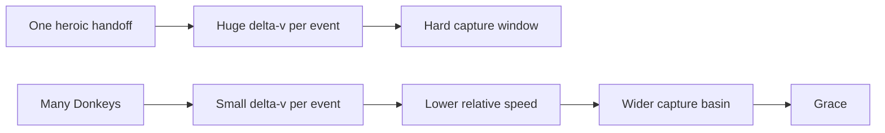

Very crudely, an equatorial payload already starts with Earth's eastward rotation. Low Earth orbit requires roughly 7.8 km/s of tangential speed. The missing velocity does **not** have to arrive in one step.

A thousand equal 7 m/s-ish nudges is not a real trajectory calculation, but it demonstrates the decomposition:

> **More Donkeys can make each Donkey less ridiculous.**

Whether that trade actually closes after tether mass, drag, losses, timing, maintenance, and support infrastructure is the research question.

---

# Part II — Turn the elevator upside down

## 4. The usual elevator asks one cable to be a miracle

A conventional space elevator is anchored near Earth and extends far beyond geostationary altitude. The cable is one enormous global tensile member.

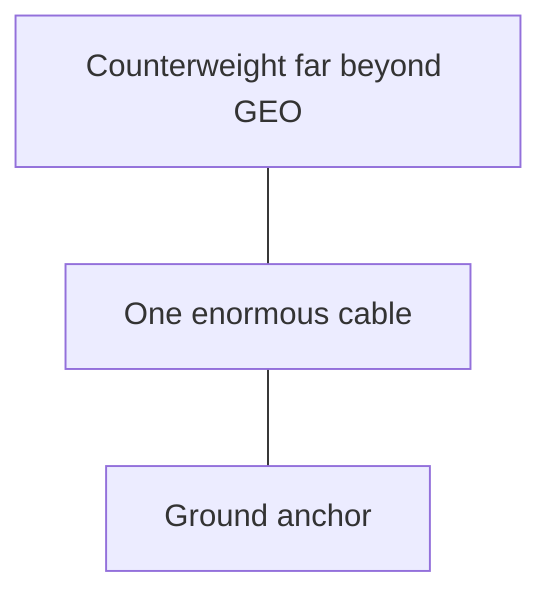

SpaceDonkey points the architecture the other way.

Put persistent infrastructure **above** the payload and hang bounded working elements inward.

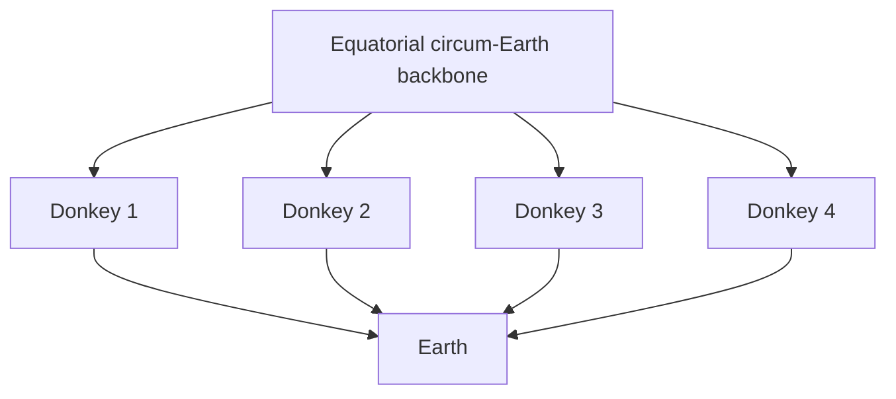

This does **not** make gravity disappear.

It changes the decomposition.

Instead of one cable solving Earth-to-space globally, many bounded tethers solve local capture-and-transfer problems, while the backbone solves support, energy, and load distribution.

That is potentially friendlier to redundancy:

> Donkey #417 can fail without requiring Donkeys #1–416 and #418–5000 to fail with it.

That claim is an engineering goal, not yet a demonstrated property.

---

## 5. Why go all the way around Earth?

Because a ring gives us **multiplicity**.

Paul Birch's 1982 orbital-ring work studied massive rings in low orbit supporting stationary “skyhooks” electromagnetically. The skyhooks could remain over chosen places on Earth while the ring material itself moved beneath them. Later work explicitly proposed rotating slings attached to an equatorial circum-Earth ring.

SpaceDonkey steals the useful geometry without yet committing to one exact ring implementation.

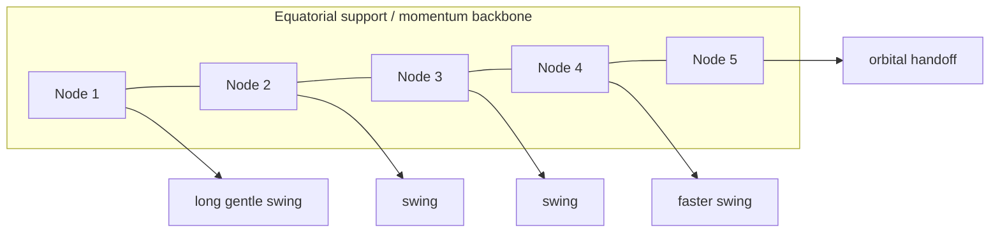

The exact backbone is an open design choice:

- Birch-style orbital ring with stationary supported nodes,
- a dynamically supported stationary structure,
- a constellation or partial-ring bootstrap,
- or something we have not found yet.

The payload only cares about one thing:

> **Is the next reachable Donkey there when I arrive?**

---

# Part III — The physics bill still arrives

## 6. No free momentum

Every Donkey that speeds up a payload must get that momentum from somewhere.

If a tether gives the payload forward momentum, the tether/backbone receives the opposite reaction.

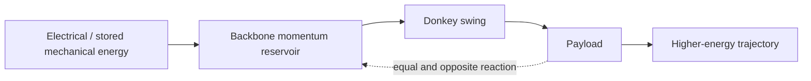

Over one complete trip, the accounting must close:

\[
\sum_i \Delta E_i = E_{\text{orbit}} - E_{\text{start}} + E_{\text{losses}},
\]

and similarly for angular momentum.

SpaceDonkey is **not** an energy loophole.

The possible efficiency comes from where the machinery lives:

- the payload need not carry all of its reaction mass,
- accelerators can be reused,
- energy can be supplied electrically over time,
- large momentum reservoirs can be recharged between payloads,
- inbound payloads may eventually return some energy and momentum to the infrastructure rather than throwing it away as atmospheric heat.

Think **railroad**, not perpetual motion.

---

## 7. The local move

Here is the smallest claim SpaceDonkey actually needs.

For one Donkey:

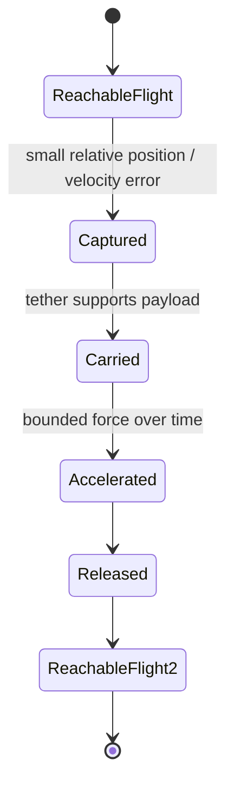

If that move can be made safe, efficient, and repeatable, ask whether **two** such moves compose.

Then ten.

Then enough.

We do not need to solve the whole planet before learning whether the local move exists.

---

# Part IV — The wicked geometry underneath

## 8. A payload state is more than a place

A Donkey does not catch a payload merely because both are at the same point.

They need compatible **position, velocity, and time**.

Call the payload state

\[
S = (\mathbf r, \mathbf v, t).
\]

For Donkey \(i\), define:

- \(C_i\): states it can safely **capture**,
- \(R_i\): states it can safely **release**.

The Donkey chain works when the released states of one stage overlap the capture states of the next:

\[
R_i \cap C_{i+1} \neq \varnothing.
\]

And eventually:

\[
R_N \cap \mathcal O \neq \varnothing,
\]

where \(\mathcal O\) is a useful set of orbital states.

That is the SpaceDonkey problem in one picture:

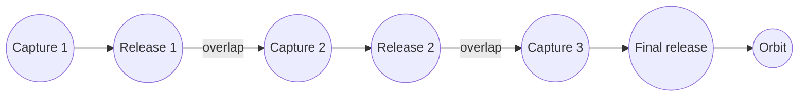

The design target is not merely maximum throw.

It is **large, robust overlap**.

That is what we mean by **grace**.

---

## 9. What would kill the idea?

A good weird idea should come with instructions for murdering it.

SpaceDonkey fails if any unavoidable constraint prevents the local moves from composing.

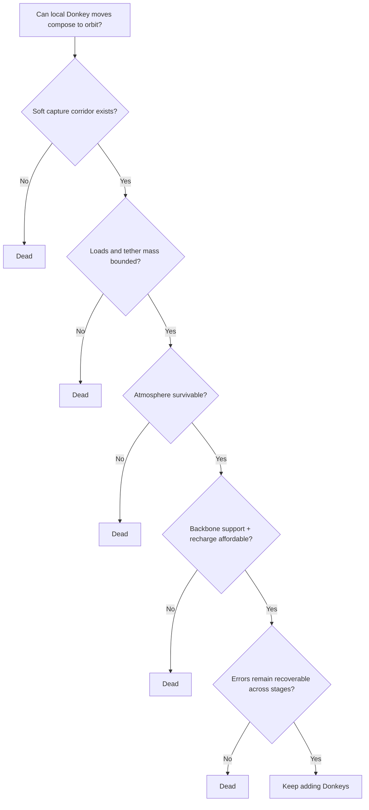

The important failure modes are:

1. **Capture geometry** — perhaps a useful long-duration low-relative-velocity corridor cannot actually be shaped.
2. **Tether stress and mass** — perhaps every useful Donkey becomes too heavy or highly loaded.
3. **Atmospheric drag and heating** — perhaps useful lower swings cannot coexist with dense atmosphere.
4. **Backbone dynamics** — perhaps ring support, vibration, torque, and stabilization dominate the system.
5. **Recharge cost** — perhaps replacing the momentum given to payloads is too slow or lossy.
6. **Error propagation** — perhaps hundreds of rendezvous make reliability exponentially awful rather than graceful.
7. **Debris and failure containment** — perhaps the geometry is incompatible with safe orbital traffic.
8. **Bootstrap** — perhaps the mature system is attractive but getting enough infrastructure into place first is economically absurd.

If one of those is fatal, great. We learned something.

---

# Part V — We did not invent space tethers

## 10. Prior art is part of the machine

SpaceDonkey is deliberately compositional. We want to borrow anything that already works.

### Orbital rings — Paul Birch, 1982

Birch described low-Earth orbital rings supporting stationary skyhooks and shorter hanging cables, explicitly as an alternative to a single geostationary elevator cable.

- [Orbital Ring Systems and Jacob's Ladders — I (JBIS, 1982)](https://nss.org/wp-content/uploads/Orbital-Rings.pdf)

### HASTOL — Boeing / Tethers Unlimited / University of Maryland / NIAC, 1999–2001

HASTOL studied a hypersonic aircraft meeting the tip of a huge rotating orbital tether. The tether was designed to match the incoming vehicle's motion, capture the payload, rotate, and release it into a higher-energy trajectory.

- [HASTOL Phase II final report](https://www.niac.usra.edu/files/studies/final_report/391Grant.pdf)

### MXER — NASA, early 2000s

The Momentum Exchange / Electrodynamic Reboost concept treated a rotating tether as a reusable in-space upper stage. After donating orbital energy and momentum to a payload, an electrodynamic tether could slowly restore the facility's orbit without propellant.

NASA's own studies also make clear how hard rendezvous is: a roughly 100 km flexible tether may offer a capture window of only a few seconds and require very accurate prediction.

- [NASA: MXER Simulation Study](https://ntrs.nasa.gov/citations/20060051892)
- [NASA: Design Concept for a Reusable/Propellantless MXER System](https://ntrs.nasa.gov/citations/20060005548)

### Sling-on-a-Ring — Meulenberg & Poston, 2011

This one is hilariously close in appearance: an equatorial circum-Earth ring with rotating sling modules. The paper proposes roughly 600 km slings dipping to around 13 km altitude and collecting payloads from conventional aircraft.

Its own abstract emphasizes **split-second timing**.

SpaceDonkey's question is almost the opposite:

> **What if we use more swings specifically so that no single swing needs to be heroic or split-second?**

- [Sling-on-a-Ring: Structure for an elevator to LEO](https://doi.org/10.1016/j.phpro.2011.08.021)

### Multi-stage tether networks

Sequential tether transfers are also prior art. A recent example numerically studies multiple rotating tethers linked by intermediate free-flight/elliptical trajectories.

- [Space-Clock Elevator: Multi-Stage Orbital Transport via Rotating Tethers and Elliptical Nodes (2026)](https://arxiv.org/abs/2604.11221)

So the novelty question, if there is one, is **not “did anyone think of a tether?”**

It is whether this particular design objective is useful:

> **Use a high stage count to trade maximum throw for grace, bounded loads, free-flight recovery, and overlapping reachable states.**

We are not claiming the answer is yes yet.

---

# Part VI — First experiment

## 11. Start with one Donkey

Do **not** simulate a 40,000 km megastructure first.

Start with one payload and one controllable tether in a simplified equatorial plane.

Ask whether there exists a capture–carry–release trajectory satisfying all of these:

- low relative velocity at capture,
- a non-trivial capture-time window,
- bounded payload acceleration,
- bounded tether tension,
- useful prograde momentum gain,
- a released trajectory that remains recoverable,
- explicit energy and momentum accounting.

Then add Donkey #2.

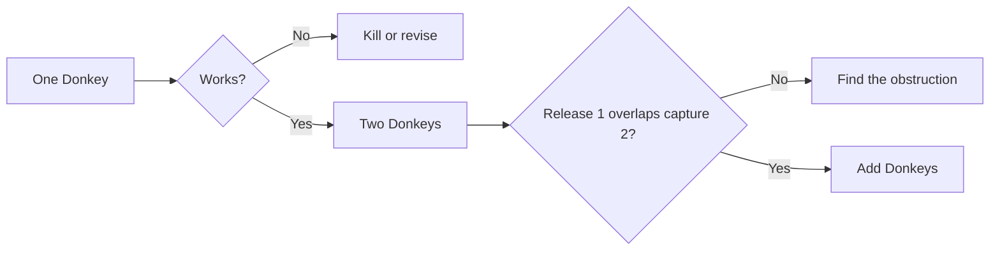

The first useful result might be a failure.

For example:

> No capture path simultaneously permits enough grace, acceptable acceleration, and useful momentum gain below a specified altitude.

That would already tell us where the architecture breaks.

The interesting result would be a family of local moves that keeps composing.

---

# The whole idea in one sentence

> **Do not build one impossible road to orbit. Build enough moving handles that the payload can always reach the next legal move.**

That is SpaceDonkey.

And yes, the working scientific description is still:

## **Donkey Kong to space.**

---

## Technical companion

See [`RESEARCH.md`](RESEARCH.md) for the mechanics ledger, explicit claims vs. hypotheses, prior-art notes, and the first simulation specification.
