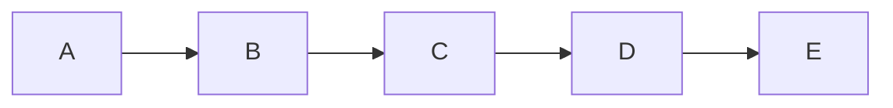
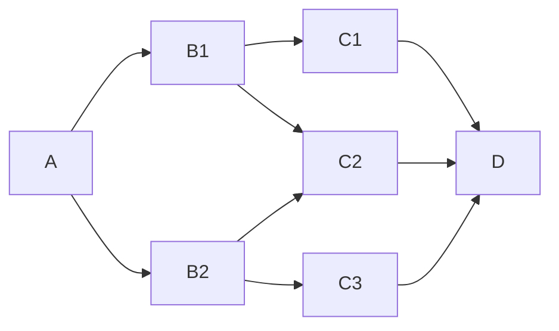

# SpaceDonkey — Research Ledger

This file is the technical underside of the layman-facing [`README.md`](README.md).

The project is intentionally **not** an academic-paper performance. The goal is to keep the explanatory geometry simple while making every important physical claim inspectable.

---

# 1. Core research question

Can a reusable sequence of hanging or rotating momentum-exchange elements:

1. softly capture a ballistic or gliding payload,
2. add useful orbital energy and angular momentum over a finite acceleration arc,
3. release the payload into a state reachable by the next element,
4. repeat until the payload reaches a useful orbit,
5. and restore the infrastructure's lost energy/momentum with acceptable efficiency?

The central SpaceDonkey hypothesis is **not** that one tether can do this. Prior art already studies that.

The hypothesis is that **high stage count may improve the architecture** by trading large per-stage throw for larger capture tolerance, lower relative velocity, bounded acceleration, recovery opportunities, and smaller local failures.

---

# 2. Claims, hypotheses, and open questions

## Established mechanics

These are ordinary consequences of mechanics and existing tether literature.

### C1 — Orbital insertion does not require monotonic altitude

A trajectory can descend while increasing speed. Orbital state depends on position and velocity, not altitude alone.

### C2 — Momentum can be transferred by a tether over time

A captured payload constrained by a moving tether experiences forces over a finite interval. The tether system loses corresponding energy and momentum unless actively powered during the maneuver.

### C3 — A longer radius lowers centripetal acceleration at fixed tip speed

\[
a_c = \frac{v^2}{r}.
\]

For equal tangential speed \(v\), increasing \(r\) reduces required centripetal acceleration.

### C4 — A reusable momentum-exchange system must be reboosted

The infrastructure loses orbital/mechanical energy and momentum when it accelerates an outbound payload. Existing MXER concepts explicitly address this by slow electrodynamic reboost.

### C5 — Capture is a state-matching problem

The payload and capture device must match sufficiently closely in position, velocity, orientation, and time. NASA MXER work treats the capture window and prediction accuracy as major design constraints.

---

## SpaceDonkey hypotheses

These are **not yet established**.

### H1 — High stage count can buy grace

Reducing the required momentum exchange per event may permit lower relative capture velocity and a broader useful rendezvous region.

This is the main design hypothesis.

### H2 — A shaped capture arc can outperform a capture instant

Rather than optimizing one exact intercept, a long/controlled tether may be able to create an interval over which relative state error remains small enough for capture.

### H3 — Free-flight legs are a feature

Release between Donkeys may allow the payload to glide, coast, dive, correct errors, or move geographically toward a better next capture state instead of remaining permanently attached to one mechanism.

### H4 — Many bounded tethers can be more fault-tolerant than one global elevator member

A modular system may permit local isolation and replacement. This requires explicit failure-containment design; it does not follow automatically from using many tethers.

### H5 — A common circum-Earth backbone may make multiplicity practical

A ring or ring-like support/momentum network may distribute energy, loads, synchronization, and many capture nodes around Earth. The exact backbone remains open.

---

# 3. State-space formulation

Let payload state be

\[
S = (\mathbf r, \mathbf v, q, \boldsymbol\omega, t),
\]

where \(\mathbf r\) and \(\mathbf v\) are position and velocity, \(q\) is attitude, \(\boldsymbol\omega\) is angular rate, and \(t\) is time.

For a minimal translational model, use

\[
S = (\mathbf r, \mathbf v, t).
\]

For Donkey \(D_i\), define a **capture set**

\[
C_i \subset \mathcal S
\]

containing states from which capture can be achieved while respecting specified limits on relative velocity, acceleration, tether load, geometry, and timing.

Define a **release set**

\[
R_i \subset \mathcal S
\]

containing states reachable after safe capture and bounded manipulation by that Donkey.

A chain exists if

\[
R_i \cap C_{i+1} \neq \varnothing
\]

for every required handoff, and eventually

\[
R_N \cap \mathcal O \neq \varnothing,
\]

where \(\mathcal O\) is a chosen set of useful orbital states.

This is the cleanest mathematical statement of “Donkey Kong to space.”

---

# 4. Grace

“Grace” is currently an engineering design concept, not a finalized scalar metric.

Informally, grace means **how much error the architecture can tolerate while still preserving a useful next move**.

A future metric might combine:

- position-error tolerance,
- velocity-error tolerance,
- timing-window width,
- attitude tolerance,
- acceleration margin,
- tether-load margin,
- size/volume of the next-stage reachable set.

One abstract possibility is to define grace in terms of the measure of a robust overlap region:

\[
G_i \propto \mu\big(R_i^{\text{robust}} \cap C_{i+1}^{\text{robust}}\big),
\]

where \(\mu\) is an appropriate measure in a normalized state space.

That expression is only a research placeholder. Different state dimensions require nondimensionalization before such a metric would be meaningful.

The qualitative design objective is firm:

> **maximize robust overlap, not maximum throw.**

---

# 5. Energy and momentum accounting

For a payload of mass \(m\), specific mechanical orbital energy in a two-body approximation is

\[
\epsilon = \frac{v^2}{2} - \frac{\mu_E}{r},
\]

with total payload energy

\[
E = m\epsilon.
\]

Specific angular momentum is

\[
\mathbf h = \mathbf r \times \mathbf v.
\]

SpaceDonkey cannot avoid the required change in orbital energy and angular momentum.

Across all stages:

\[
\sum_i W_i = \Delta E_{\text{payload}} + E_{\text{losses}},
\]

and the full system must conserve angular momentum after accounting for Earth, backbone, rotors, motors, electromagnetic interactions, propellant if any, and released/inbound masses.

The possible advantage is **system architecture**, not free energy:

- reusable machinery remains external to the payload,
- energy can be supplied electrically,
- energy can be accumulated slowly and delivered mechanically in bursts,
- momentum reservoirs can be large compared with one payload,
- inbound traffic may permit partial regenerative recovery.

---

# 6. One-Donkey mechanics

A first model should avoid committing to a global ring design.

## Minimal model

- 2D equatorial plane.
- Spherical Earth.
- Point-mass payload.
- One tether with prescribed pivot trajectory.
- Initially massless rigid tether; later replace with flexible distributed mass.
- Adjustable tether length \(r_t(t)\).
- Adjustable tether angle/torque subject to physical limits.
- Capture only if state mismatch lies inside specified bounds.
- Explicit impulse/energy accounting at capture.
- Finite-time constrained motion after capture.
- Release at an optimized state.

## Objective

Find a maneuver maximizing a weighted combination of:

- useful prograde \(\Delta v\),
- capture duration / tolerance,
- next-stage reachability,
- low peak acceleration,
- low peak tether tension,
- low dissipative capture loss.

Subject to:

\[
a_{\max} \le a_{\text{limit}},
\]

\[
T_{\max} \le T_{\text{limit}},
\]

and atmospheric/altitude constraints.

The optimizer should be rewarded for **grace**, not merely release speed.

---

# 7. Two-Donkey composition test

After a one-Donkey solution exists, introduce a second independently controlled capture element.

Do not optimize the first Donkey in isolation.

Optimize the pair for overlap:

\[
\max \; \mu(R_1 \cap C_2)
\]

under the same physical bounds.

Questions:

1. Does a larger first-stage throw make stage 2 harder to reach?
2. Is there an optimal deliberately *smaller* first-stage throw that creates much more grace?
3. Does a downward free-flight leg improve the next capture geometry?
4. Can the first release be chosen to create a long near-co-moving segment with Donkey 2?
5. Do timing uncertainties grow or shrink after each controlled capture?

This is the first experiment that directly tests the distinctive SpaceDonkey thesis.

---

# 8. Why dives may matter

A payload released from one Donkey need not immediately climb toward the next.

A descent can convert gravitational potential energy into kinetic energy while moving the payload geographically and changing its flight-path angle.

The useful question is not “did the payload go down?”

It is:

> Did the free trajectory place the payload inside a larger or more useful capture set for the next Donkey?

This invites non-monotonic optimization.

A future path solver should not impose

\[
r_{i+1} > r_i.
\]

It should search all physically permitted trajectories satisfying endpoint reachability and safety constraints.

---

# 9. Prior-art map

The right posture is inheritance, not novelty theater.

## Paul Birch — Orbital Ring Systems and Jacob's Ladders (1982)

Birch proposed low-Earth orbital rings with stationary skyhook stations supported electromagnetically from the moving orbital ring. Shorter cables could hang from the stations instead of requiring one cable to geostationary altitude.

Source:

- Paul Birch, *Orbital Ring Systems and Jacob's Ladders — I*, Journal of the British Interplanetary Society 35 (1982), 475–497.
  - https://nss.org/wp-content/uploads/Orbital-Rings.pdf

What SpaceDonkey inherits:

- circum-Earth support geometry,
- stationary geographic nodes riding on moving orbital infrastructure,
- shorter bounded hanging members instead of a GEO elevator cable.

What remains open:

- whether Birch-style support is the best backbone for a many-Donkey network.

---

## HASTOL — 1999–2001

The Hypersonic Airplane Space Tether Orbital Launch system studied transfer from a hypersonic aircraft to a rotating orbital tether. A grapple at the tether tip would meet the incoming vehicle, take the payload, rotate, and release it into a higher-energy orbit.

The HASTOL architecture directly validates the **local mechanical motif** of matching a moving tether tip to a suborbital payload.

Sources:

- NIAC Phase I/interim HASTOL report:
  - https://www.niac.usra.edu/files/studies/final_report/355Bogar.pdf
- HASTOL Phase II final report:
  - https://www.niac.usra.edu/files/studies/final_report/391Grant.pdf

What SpaceDonkey changes:

- HASTOL attempts a very large transfer with one tether.
- SpaceDonkey asks whether many smaller transfers can reduce capture severity and increase recoverability.

---

## MXER — early/mid 2000s

NASA's Momentum eXchange / Electrodynamic Reboost work treated a rotating tether as a reusable in-space upper stage.

A payload receives energy/momentum from the tether. The tether facility then slowly restores its orbital energy using electrodynamic interaction with Earth's magnetic field.

Sources:

- NASA, *A Model for Dynamic Simulation and Analysis of Tether Momentum Exchange*:
  - https://ntrs.nasa.gov/archive/nasa/casi.ntrs.nasa.gov/20020046691.pdf
- NASA, *Design Concept for a Reusable/Propellantless MXER Tether Space Transportation System*:
  - https://ntrs.nasa.gov/citations/20060005548
- NASA, *MXER Simulation Study*:
  - https://ntrs.nasa.gov/citations/20060051892
- Bonometti et al., *2006 Status of the MXER Tether Development*:
  - https://ntrs.nasa.gov/citations/20060047739

Important constraint inherited from MXER:

- long flexible tethers are difficult to predict and control precisely;
- studied capture windows may be only a few seconds;
- high-accuracy rendezvous is a primary technical problem.

SpaceDonkey therefore treats **rendezvous grace as a first-class optimization target**.

---

## Sling-on-a-Ring — 2011

Meulenberg and Poston proposed an equatorial circum-Earth ring with rotating sling modules. Their concept uses approximately 600 km sling assemblies that periodically descend into the atmosphere to around 13 km. Sling-tip rotation is arranged to nearly cancel ring motion relative to the surface during pickup of a payload from an aircraft.

Source:

- Andrew Meulenberg & Paul S. Poston, *Sling-on-a-Ring: Structure for an elevator to LEO*, Physics Procedia 20 (2011), 222–231.
  - https://doi.org/10.1016/j.phpro.2011.08.021

This is the closest visual prior art to SpaceDonkey.

Important distinction:

- Sling-on-a-Ring still seeks a very large single-stage transfer and explicitly relies on split-second pickup timing.
- SpaceDonkey asks whether **many smaller ring-supported transfers can intentionally trade performance per swing for capture grace**.

That distinction needs literature review before any novelty claim.

---

## Multi-stage rotating tether networks

Sequential tether transfer is itself prior art.

A recent example:

- Maksim A. Kazanskii, *Space-Clock Elevator: Multi-Stage Orbital Transport via Rotating Tethers and Elliptical Nodes* (2026).
  - https://arxiv.org/abs/2604.11221

The work numerically studies multiple rotating tethers coupled through intermediate elliptical/free-flight nodes.

SpaceDonkey should therefore be presented as a **design objective / geometry question**, not “the first multi-tether elevator.”

---

# 10. Major kill tests

## K1 — Capture corridor does not exist

If useful momentum transfer requires such high relative velocity or such narrow timing that no practical soft-capture region exists, the central “grace” thesis fails.

## K2 — High stage count makes reliability worse faster than it makes capture easier

If each handoff has reliability \(p\), a naive independent chain gives \(p^N\), which becomes terrible for large \(N\).

SpaceDonkey therefore requires either:

- extremely high per-stage reliability,
- alternate/redundant next Donkeys,
- recoverable missed handoffs,
- or a network topology where failure does not terminate the journey.

This may be the strongest argument for free-flight recovery and many reachable nodes rather than one fixed linear chain.

## K3 — Atmosphere wins

Lower tethers may encounter unacceptable drag, heating, acoustic loads, oxidation, or weather effects.

The practical lower boundary may therefore be far above aircraft altitude.

If so, SpaceDonkey may still be useful as a staged upper transport network, but not as a near-ground replacement for launch propulsion.

## K4 — Tether mass scales badly

The useful \(\Delta v\), radius, payload mass, tether strength, taper, fatigue margin, and safety factor may produce prohibitive tether mass.

## K5 — Backbone dominates everything

A circum-Earth support/momentum architecture may require so much mass, stabilization, and standing power that local Donkey efficiency becomes irrelevant.

## K6 — Recharge throughput is too low

The system may be mechanically efficient per transfer but unable to replenish momentum quickly enough for useful traffic rates.

## K7 — Debris and traffic make the geometry unsafe

Thousands of long moving tethers could create unacceptable collision cross-section unless operating regions, avoidance, redundancy, and severability are exceptionally well designed.

## K8 — Bootstrap is economically impossible

A mature network may be excellent and still fail because initial infrastructure must be launched using conventional systems before it can assist later construction.

A successful architecture probably needs a useful partial-network bootstrap path.

---

# 11. Efficiency: what must actually be measured

Do not call SpaceDonkey “efficient” based only on the absence of onboard propellant.

At minimum distinguish:

## Transfer efficiency

\[
\eta_{\text{transfer}}
=
\frac{\Delta E_{\text{payload}}}
{E_{\text{mechanical/electrical input during transfer}}}.
\]

## Recharge efficiency

\[
\eta_{\text{recharge}}
=
\frac{\Delta E_{\text{reservoir restored}}}
{E_{\text{electrical/propulsive input}}}.
\]

## System efficiency

\[
\eta_{\text{system}}
=
\frac{\Delta E_{\text{payload}}}
{E_{\text{transfer}}+E_{\text{recharge}}+E_{\text{support}}+E_{\text{control}}+E_{\text{losses}}}.
\]

The system must also be evaluated economically per kg delivered, including capital mass, maintenance, traffic rate, and amortization.

---

# 12. Reliability should be modeled as a network, not a chain

A naive chain has one next node at every stage:

That is fragile.

A graceful network should try to provide several reachable next states:

Then a missed or unavailable Donkey need not be mission-ending.

This may be another genuine benefit of going around Earth with many nodes: **redundancy in reachable state space**.

---

# 13. Candidate development sequence

### Stage 0 — Literature map

Build a compact bibliography covering:

- orbital rings,
- rotovators / skyhooks,
- HASTOL,
- MXER,
- Sling-on-a-Ring,
- staged/multi-tether transfer,
- flexible-tether capture control,
- motorized tethers,
- tether materials and debris survivability.

### Stage 1 — One massless Donkey

Prove or refute useful capture–carry–release geometry in 2D.

### Stage 2 — Two Donkeys

Optimize overlap between release and next capture basin.

### Stage 3 — Atmosphere

Add drag, lift, heating proxies, and altitude constraints.

### Stage 4 — Flexible tether

Replace ideal rigid tether with distributed-mass elastic tether dynamics.

### Stage 5 — Recharge

Add finite momentum reservoir and explicit restoration mechanism.

### Stage 6 — Network

Search for many-node geometries with redundancy and bounded per-node workload.

### Stage 7 — Backbone

Only after the local transfer network shows value should the project commit to a specific global support structure.

---

# 14. Current strongest statement

SpaceDonkey does **not** presently establish that a many-swing Earth-to-orbit transport system is buildable, economical, safe, or superior to rockets.

It does identify a falsifiable design question assembled from serious prior art:

> **Does increasing the number of momentum-exchange stages create enough rendezvous grace, bounded acceleration, redundancy, and recovery to outweigh the added tether, control, reliability, and infrastructure burden?**

That question can be attacked incrementally.

And the layman's version remains accurate:

> **Can Donkey Kong Donkey Kong his way to orbit?**
